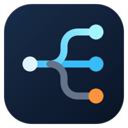

<div align="center">
  
  <h1>funnysurge</h1>
  <p><strong>按自己的习惯，让连接各走其路。</strong></p>
  <p>
    
    
    
    <a href="LICENSE"></a>
  </p>
  <p><a href="#快速开始"><strong>快速开始</strong></a> · <a href="docs/rules.md">规则索引</a> · <a href="docs/usage.zh-Hans.md">配置指南</a> · <a href="README.md">English</a></p>
</div>

funnysurge 是我个人维护的 Surge 与 Clash / Mihomo 分流规则，覆盖 AI 服务、开发工具、媒体、直连需求和个人屏蔽名单。按需订阅规则，再指定适合自己的策略。

仓库也保留了一份个人 Surge 基础配置。节点需要自备；这里提供规则和配置示例，没有代理节点或订阅服务。

## 从哪里开始

| 你想做什么 | 对应入口 |
| --- | --- |
| 为 ChatGPT、Claude、Gemini 等服务单独分流 | [规则索引](docs/rules.md)，包含各客户端的原始订阅链接 |
| 给已有 Surge 配置添加规则 | [Surge 配置片段](examples/surge-rules.conf) |
| 给 Clash / Mihomo 添加 rule-provider | [YAML 配置片段](examples/clash-rule-providers.yaml) |
| 使用完整的 Surge 基础配置 | [base.conf](base.conf) 与[接入说明](docs/usage.zh-Hans.md#使用-surge-基础配置) |
| 了解个人屏蔽名单的取舍 | [Reject 策略与来源](docs/reject.md) |

## 快速开始

先准备一份能正常使用的客户端配置，以及自己的代理节点或策略组。以下示例用 `PROXY` 作为策略名，请替换成你已有的策略名称。

### Surge

把这一行放进已有的 `[Rule]` 段，排在可能先匹配的宽泛规则和 `FINAL` 之前：

```ini
RULE-SET,https://raw.githubusercontent.com/max1874/funnysurge/main/rules/OpenAI.txt,PROXY
```

保存配置并更新规则集后，在 Surge 请求记录中查看实际命中的规则和策略。[Surge 配置片段](examples/surge-rules.conf)中还有其他服务，以及可选的直连和屏蔽规则。

### Clash / Mihomo

把 provider 合并到已有的 `rule-providers`，把匹配规则合并到 `rules`，排在可能先匹配的宽泛规则和 `MATCH` 之前。保留自己的节点和策略组。

```yaml
rule-providers:
  funnysurge-openai:
    type: http
    behavior: classical
    format: yaml
    url: https://raw.githubusercontent.com/max1874/funnysurge/main/clash/OpenAI.txt
    path: ./rule-providers/funnysurge-openai.yaml
    interval: 86400

rules:
  - RULE-SET,funnysurge-openai,PROXY
```

这些 `.txt` 文件实际包含 YAML `payload` 列表，应使用 `behavior: classical` 和 `format: yaml`。合并方式、更新与排查说明见[配置指南](docs/usage.zh-Hans.md)。

## 目录结构

```text
funnysurge/
├── README.md                  英文首页
├── README.zh-Hans.md          中文说明
├── base.conf                  Surge 基础配置，使用前需调整
├── rules/                     Surge 规则集（.txt）
├── clash/                     Clash / Mihomo 规则集（.txt，内容为 YAML）
├── examples/                  合并到已有配置中的示例片段
├── docs/                      规则索引、配置指南、Reject 来源
├── assets/                    项目图标
└── LICENSE                    MIT 许可证
```

`rules/`、`clash/` 和 `base.conf` 保留原有公开路径，已有的原始订阅链接可以继续使用。按服务找规则看索引，按客户端找文件看对应目录。

## 范围与维护方式

- **个人筛选，手动维护。** 规则反映我的使用习惯，可能需要按你的环境调整。部分条目匹配共享基础设施或较宽的关键词，服务名称不代表命中的连接只属于该服务。
- **聚合规则与独立规则按需选择。** `AI.txt` 包含多个 AI 服务和一些额外域名，独立维护，并非其他文件自动合并后的精确合集。
- **两种格式存在差异。** 当前有 20 份 Surge 规则、19 份 Clash 规则；TikTok 暂时只有 Surge 版。同名文件的覆盖范围也可能不同，已知差异见[规则索引](docs/rules.md)。
- **Reject 是个人访问偏好。** 名单包含 CSDN、博客园等站点，阻止连接，不会隐藏搜索结果，也不代表恶意网站判定。启用前请阅读[策略与来源](docs/reject.md)。

如需纠错，请在 [issue](https://github.com/max1874/funnysurge/issues) 中提供受影响的域名、客户端、规则文件和期望的分流结果。修改规则前可先看[维护约定](docs/usage.zh-Hans.md#维护规则)。

## 来源与许可证

基础配置还引用了 [Sukka](https://github.com/SukkaW/Surge)、[blackmatrix7](https://github.com/blackmatrix7/ios_rule_script) 和 [Loyalsoldier](https://github.com/Loyalsoldier/surge-rules) 独立维护的规则。远程名单遵循各自的维护策略和许可证。

本仓库采用 [MIT](LICENSE) 许可证，保留原有版权声明。
